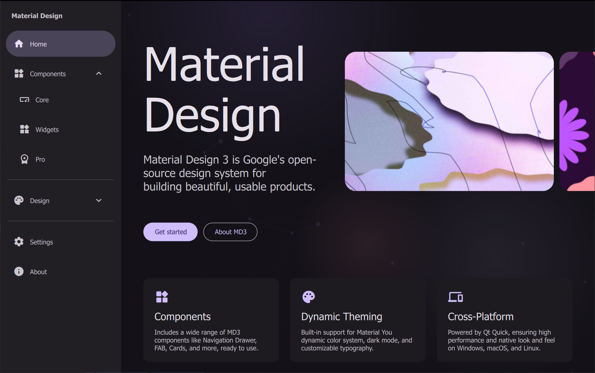
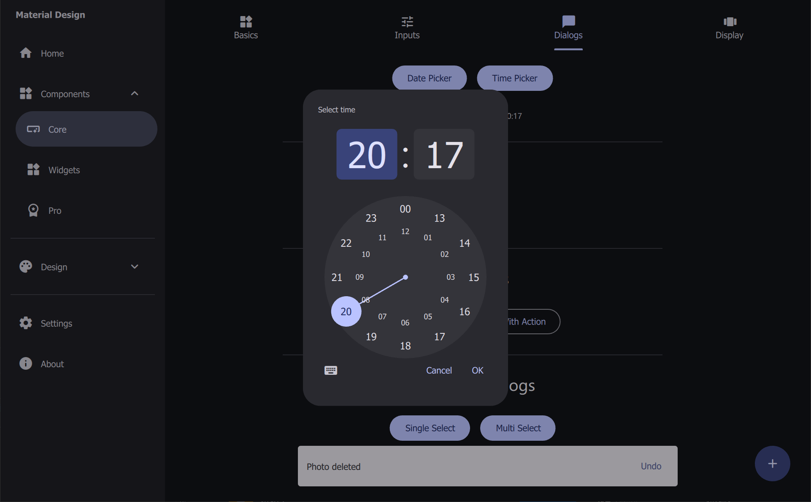

# QML MD3 Library

A modern **Material Design 3** component library for **Qt/QML**.

Built fully in **Qt Quick / QML**, focused on reusable components, theming, animations, and cross-platform UI development.

---

# Preview

> Full component showcase included (`main.qml`)

Add screenshots here:

```md




```

---

# Features

- Material Design 3 inspired
- Pure QML implementation
- Light / Dark theme support
- Custom theme engine
- Reusable components
- Responsive layouts
- Desktop & Mobile ready
- Easy integration

---

# Components

## Buttons
- Button
- IconButton
- FAB
- FabMenu
- SegmentedButton

---

## Inputs
- TextField
- CheckBox
- RadioButton
- Switch
- ComboBox
- Slider
- ColorPicker
- TimePicker

---

## Navigation
- TopAppBar
- NavigationBar
- NavigationDrawer
- NavigationRail
- Tabs
- BreadCrumb
- SideSheet

---

## Feedback
- Dialog
- SnackBar
- ToolTip
- Ripple
- LoadingIndicator

---

## Surfaces
- Card
- BlurCard
- Carousel
- Chip

---

## Progress
- CircularProgress
- LinearProgress

---

## Data Display
- DataTable
- CanvasBarChart
- CanvasLineChart
- CanvasPieChart

---

## Utilities
- ScrollBar
- Menu
- IndexBackground
- Theme

---

# Project Structure

```text
QML/
├── Assets/
│   └── MaterialIconsRound-Regular.otf
│
├── Controls/
│   ├── Button.qml
│   ├── Card.qml
│   ├── Dialog.qml
│   ├── NavigationDrawer.qml
│   ├── NavigationBar.qml
│   ├── NavigationRail.qml
│   ├── Tabs.qml
│   ├── SnackBar.qml
│   ├── DataTable.qml
│   ├── CanvasLineChart.qml
│   └── ...
│
├── Theme.qml
└── main.qml
```

---

# Installation

Clone repository:

```bash
git clone https://github.com/AndreyShabunin1999/QML_MD3_Libarary.git
```

Open in **Qt Creator** and run:

```bash
qmake
make
```

---

# Usage

Import controls:

```qml
import "QML/Controls"
```

Example:

```qml
Button {
    text: "Hello"
    type: "filled"
}
```

---

# Theme

Global theme object:

```qml
Theme.color.primary
Theme.color.secondaryContainer
Theme.color.errorContainer
```

Supports:
- dark mode
- Material-style colors

---

# Demo

Run:

```bash
qml main.qml
```

or open project:

```text
testQMLLibrary.pro
```

---

# Requirements

- Qt 5.x
- Qt Quick 2.15+

---

# License

MIT

---

# Author

Andrey Shabunin

GitHub:
https://github.com/AndreyShabunin1999
